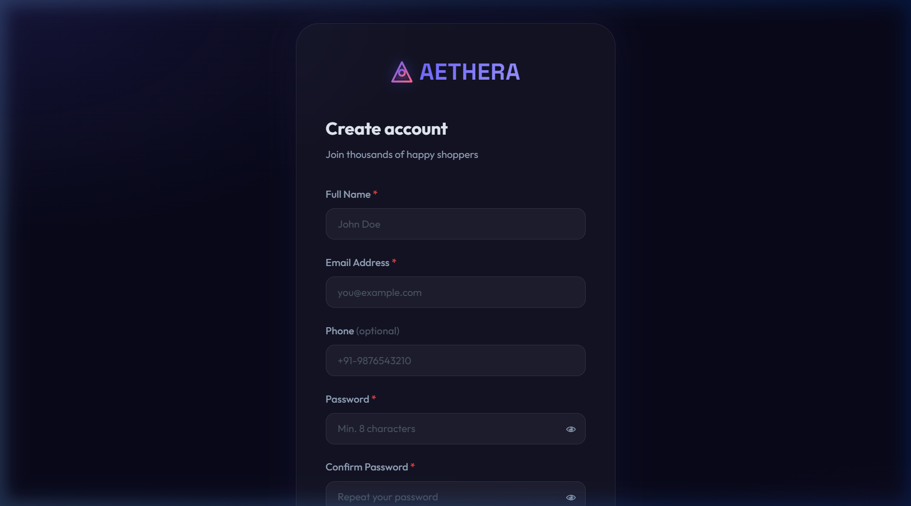
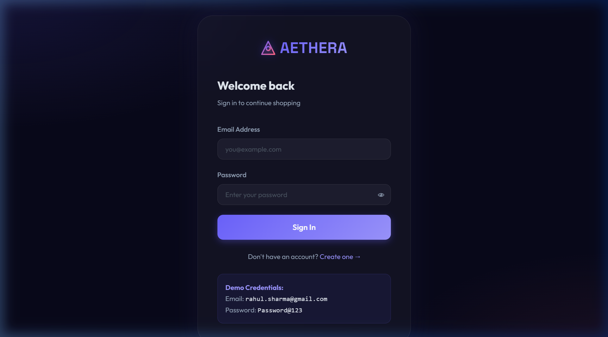
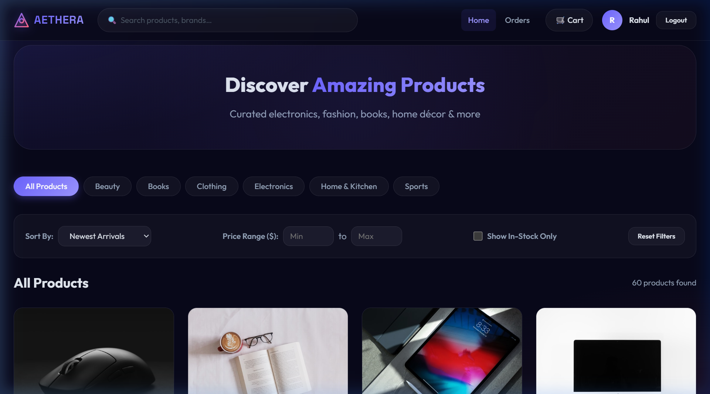
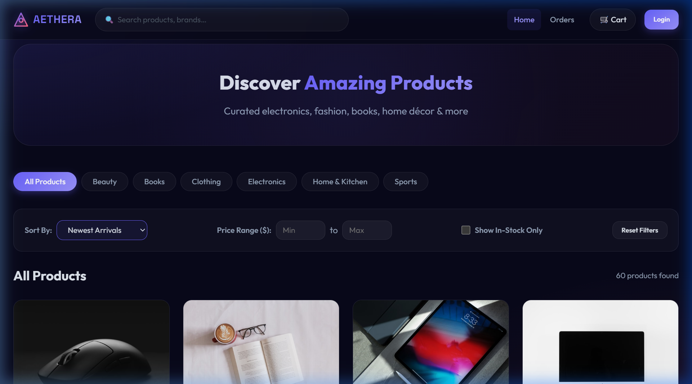
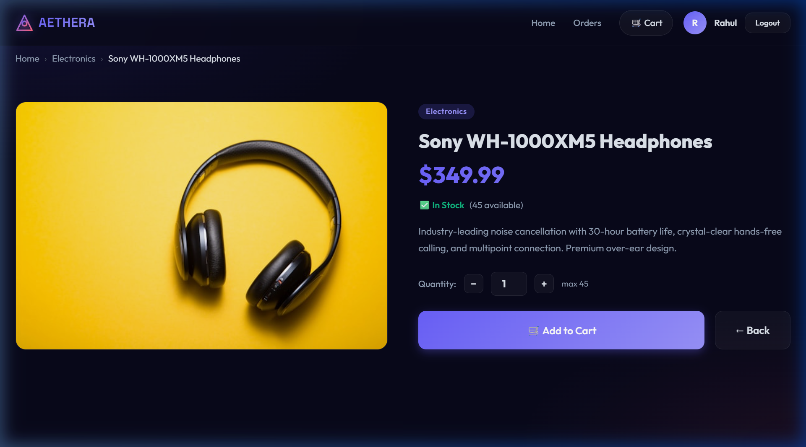
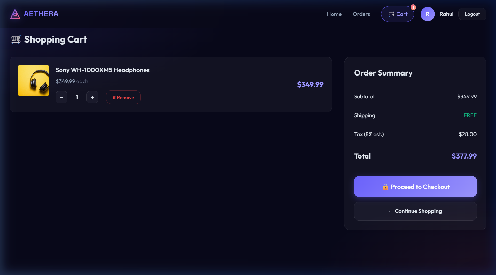
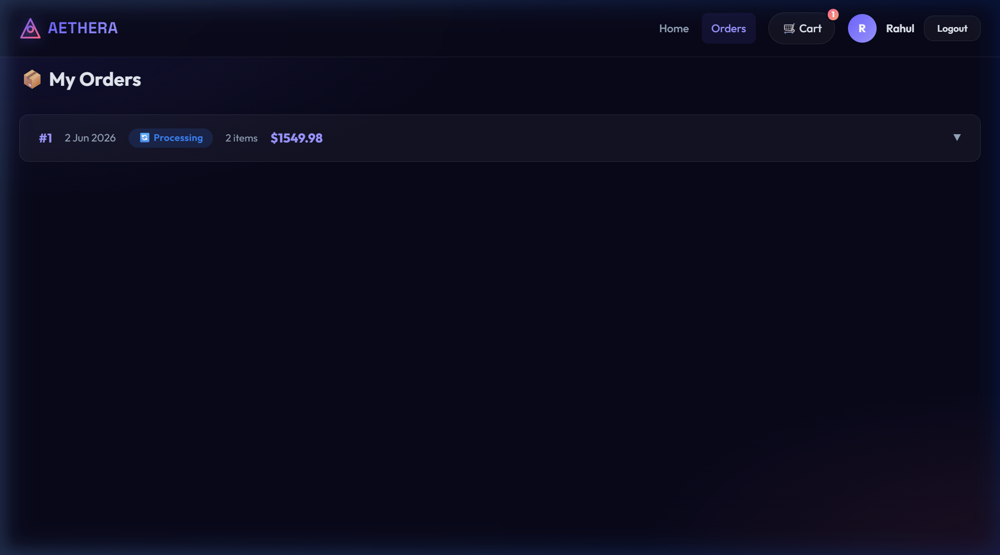
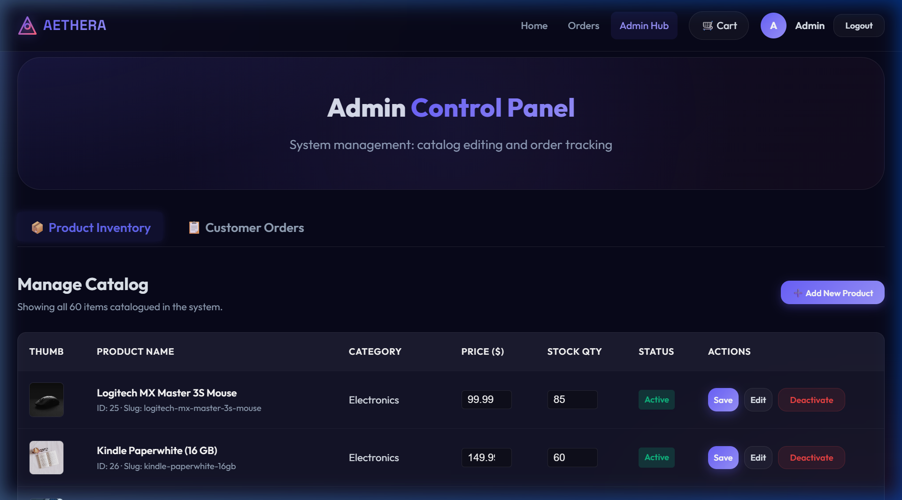
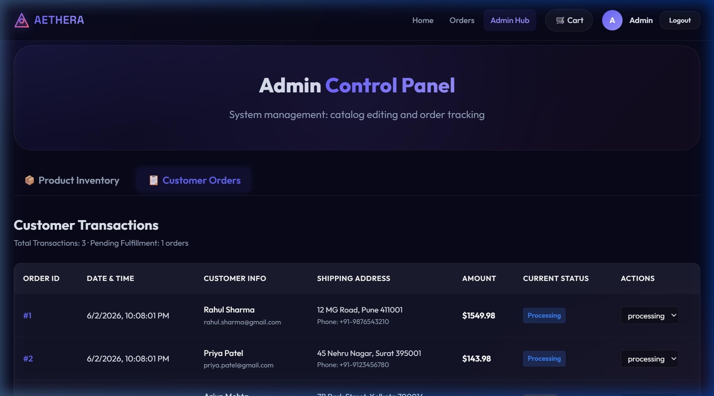

# 🌌 Aethera — E-Commerce Store

### CodeAlpha Internship · Task 1 · Full-Stack Web Application
**Aethera** is a premium, state-of-the-art full-stack e-commerce web application featuring a stunning dark glassmorphic design system. The application is built using a modern architecture separating the Node.js + Express backend API from the Vanilla JS + HTML5 frontend. It connects to a MySQL database using parameterized queries to ensure security, uses hashed passwords with bcrypt, and secures routes using JWT tokens.

---

## 👤 Demo Login Credentials

You can use the following seeded accounts to test the user and admin functionalities:

| Name | Role | Email | Password |
|:---|:---|:---|:---|
| **Rahul Sharma** | Customer | `rahul.sharma@gmail.com` | `Password@123` |
| **Admin User** | Administrator | `admin@ecommerce.dev` | `Password@123` |

---

## 📸 Visual Walkthrough (Pages & Interfaces)

Here are the detailed screenshots and descriptions of the interfaces that make up **Aethera**:

### 1. Registration Page (`register.html`)


#### Description:
The **Registration Page** features a centered dark glassmorphic card with subtle glow animations. New customers can register by providing their Full Name, Email Address, Password, Phone Number, and Shipping Address.
- **Frontend File:** [register.html](file:///c:/Users/BANSIRAJSINH/OneDrive/Desktop/Programming/Internship_CodeAlpha/Ecommerce/public/register.html)
- **Frontend Logic:** [auth.js](file:///c:/Users/BANSIRAJSINH/OneDrive/Desktop/Programming/Internship_CodeAlpha/Ecommerce/public/js/auth.js)
- **API Endpoint:** `POST /api/auth/register`
- **Features:** Password fields are hidden by default with a show/hide toggle. Client-side input validation is enforced before submitting the request to the database.

---

### 2. Login Page (`login.html`)


#### Description:
The **Login Page** matches the dark glassmorphic design language. It allows users to authenticate into the system. Based on their credentials, the system redirects them: Customers to the Home Catalog and Admins to the Admin Control Panel.
- **Frontend File:** [login.html](file:///c:/Users/BANSIRAJSINH/OneDrive/Desktop/Programming/Internship_CodeAlpha/Ecommerce/public/login.html)
- **Frontend Logic:** [auth.js](file:///c:/Users/BANSIRAJSINH/OneDrive/Desktop/Programming/Internship_CodeAlpha/Ecommerce/public/js/auth.js)
- **API Endpoint:** `POST /api/auth/login`
- **Features:** Generates a secure JSON Web Token (JWT) on success, which is stored in a cookie. It has instant login validation and red toast feedback for incorrect credentials.

---

### 3. Home / Product Catalog (`index.html`)


#### Description:
The **Home Page** serves as the main storefront catalog. It displays products in a responsive grid layout. A stylish hero banner introduces the store, followed by category quick-tabs and a dynamic filter bar.
- **Frontend File:** [index.html](file:///c:/Users/BANSIRAJSINH/OneDrive/Desktop/Programming/Internship_CodeAlpha/Ecommerce/public/index.html)
- **Frontend Logic:** [catalog.js](file:///c:/Users/BANSIRAJSINH/OneDrive/Desktop/Programming/Internship_CodeAlpha/Ecommerce/public/js/catalog.js)
- **API Endpoints:** `GET /api/products`, `GET /api/products/categories`
- **Features:** 
  - Dynamic navigation header with live search input and cart badge.
  - Category filtering tabs (All, Electronics, Clothing, Books, Home & Kitchen, Sports, Beauty).
  - Smooth skeleton loaders displayed while fetching products.
  - Image fade-in animation (`.loaded` class) preventing layout popping.

#### Sort & Filters Active View:


- **Sort Dropdown:** Sort by *Newest Arrivals*, *Price: Low to High*, *Price: High to Low*, and *Name: A to Z*. Standardized using `color-scheme: dark` to ensure high contrast in all browsers.
- **Price Filters:** Allows filtering items by minimum and maximum dollar values.
- **Stock Status Filter:** Checkbox to show only in-stock items.

---

### 4. Product Details (`product.html`)


#### Description:
The **Product Details Page** displays comprehensive information about a selected product, including its category badge, price, detailed description, and real-time stock status (e.g., "In Stock" in green, "Out of Stock" in red).
- **Frontend File:** [product.html](file:///c:/Users/BANSIRAJSINH/OneDrive/Desktop/Programming/Internship_CodeAlpha/Ecommerce/public/product.html)
- **Frontend Logic:** [product.js](file:///c:/Users/BANSIRAJSINH/OneDrive/Desktop/Programming/Internship_CodeAlpha/Ecommerce/public/js/product.js)
- **API Endpoint:** `GET /api/products/:id`
- **Features:** 
  - Interactive quantity selector that respects max available stock.
  - "Add to Cart" button which makes a secure API request.
  - Dynamic breadcrumbs for easy navigation (Home -> Category -> Product Name).

---

### 5. Shopping Cart (`cart.html`)


#### Description:
The **Shopping Cart Page** shows the list of items the user has added. It calculates the subtotal, taxes, shipping, and order total in real-time.
- **Frontend File:** [cart.html](file:///c:/Users/BANSIRAJSINH/OneDrive/Desktop/Programming/Internship_CodeAlpha/Ecommerce/public/cart.html)
- **Frontend Logic:** [cart.js](file:///c:/Users/BANSIRAJSINH/OneDrive/Desktop/Programming/Internship_CodeAlpha/Ecommerce/public/js/cart.js)
- **API Endpoints:** `GET /api/cart`, `PUT /api/cart/:productId`, `DELETE /api/cart/:productId`
- **Features:** 
  - Dynamic quantity controllers (`+` and `-` buttons) which update the database.
  - "Delete" button to remove items.
  - "Checkout" / "Place Order" button which executes an atomic transaction.

---

### 6. Customer Orders History (`orders.html`)


#### Description:
The **Orders Page** displays the customer's purchase history. Each order record contains the Order ID, date, total amount, shipping destination, and order status (e.g., Pending, Shipped, Delivered).
- **Frontend File:** [orders.html](file:///c:/Users/BANSIRAJSINH/OneDrive/Desktop/Programming/Internship_CodeAlpha/Ecommerce/public/orders.html)
- **Frontend Logic:** [orders.js](file:///c:/Users/BANSIRAJSINH/OneDrive/Desktop/Programming/Internship_CodeAlpha/Ecommerce/public/js/orders.js)
- **API Endpoint:** `GET /api/orders`
- **Features:** Accordion-style layout. Clicking an order header expands it to show the detailed line items, product thumbnails, unit prices, and quantities.

---

### 7. Admin Panel Dashboard (`admin.html`)


#### Description:
The **Admin Dashboard** is a control room restricted to users with the `admin` role. The default tab is the **Product Inventory** manager, displaying a clean layout with thumbnails, prices, stock levels, and active status toggles.
- **Frontend File:** [admin.html](file:///c:/Users/BANSIRAJSINH/OneDrive/Desktop/Programming/Internship_CodeAlpha/Ecommerce/public/admin.html)
- **Frontend Logic:** [admin.js](file:///c:/Users/BANSIRAJSINH/OneDrive/Desktop/Programming/Internship_CodeAlpha/Ecommerce/public/js/admin.js)
- **API Endpoints:** `GET /api/products` (admin access), `POST /api/products`, `PUT /api/products/:id`, `DELETE /api/products/:id`
- **Features:** 
  - Inline stock editing inputs for immediate quantity updates.
  - "Add New Product" modal with forms for name, category dropdown, price, stock quantity, description, and image URL.
  - Inline status toggle buttons and editing options.

#### Admin Customer Transactions Tab:


- **Description:** Accessible via the "Customer Orders" tab. Lists every transaction placed in the system.
- **Features:** Contains a status selector dropdown (Pending, Processing, Shipped, Delivered, Cancelled) for each order. Modifying this dropdown triggers an immediate database update and sends a toast alert.

---

## 🔄 End-to-End User Flow (Customer Journey)


1. **Onboarding:** A visitor signs up via `register.html` and logs in at `login.html`.
2. **Browsing:** The customer arrives at the Catalog page, searches for a product, and uses category tabs or the price/sorting dropdowns to filter.
3. **Investigation:** The customer views details on `product.html` and adds the item to the cart.
4. **Cart Management:** The customer navigates to `cart.html` where they can increase/decrease quantities or delete items.
5. **Atomic Checkout:** The customer places the order. The server starts a transaction:
   - Validates that every item is in-stock.
   - Decrements stock levels.
   - Saves order details.
   - Empties the user's cart in a single atomic database operation.
6. **Order Verification:** The checkout redirects the user to the `orders.html` page to review their transaction status.
7. **Administrative Oversight:** The admin logs into the portal `admin.html` and:
   - Views the new order under "Customer Orders".
   - Updates the status (e.g. from "Pending" to "Shipped").
   - Restocks or updates the price of items in "Product Inventory".

---

## 🗂 Project File Directory Structure

A clean overview of the application codebase directories and files:

```
Ecommerce/
├── database/                   # Database scripts
│   ├── schema.sql              # Sets up tables (users, categories, products, cart, orders, order_items)
│   └── seed.sql                # Seeds categories, products, and users with hashed passwords
│
├── public/                     # Static assets served to the client
│   ├── css/
│   │   └── style.css           # Global Design System: CSS Variables, Typography, Glassmorphism, Layouts
│   ├── js/
│   │   ├── api.js              # Global API managers, authentication checks, and toast alerts
│   │   ├── auth.js             # Handles login, registration, password validation, and redirects
│   │   ├── catalog.js          # Renders product grid, categories, search, sorting, and filters
│   │   ├── product.js          # Renders details of a single product and quantity controls
│   │   ├── cart.js             # Handles checkout, cart item listing, and adjustments
│   │   ├── orders.js           # Renders customer order history and line-item expanding
│   │   └── admin.js            # Handles admin dashboard tabs, inventory edits, and order updates
│   ├── admin.html              # Administrator dashboard interface
│   ├── cart.html               # Customer shopping cart checkout interface
│   ├── index.html              # Customer home storefront catalog interface
│   ├── login.html              # Login interface
│   ├── orders.html             # Customer order history interface
│   ├── product.html            # Product description detail interface
│   └── register.html           # New customer account signup interface
│
├── screenshots/                # Showcase images embedded in this documentation
│   ├── admin_orders.png
│   ├── admin_products.png
│   ├── cart.png
│   ├── home.png
│   ├── home_dropdown.png
│   ├── login.png
│   ├── orders.png
│   ├── product_detail.png
│   └── register.png
│
├── server/                     # Express.js backend application logic
│   ├── config/
│   │   └── db.js               # Database connection pool setup using mysql2/promise
│   ├── middleware/
│   │   └── authMiddleware.js   # JWT authentication checks and isAdmin role verifiers
│   ├── controllers/
│   │   ├── authController.js   # Logic for registration, login, token signing, and cookies
│   │   ├── productsController.js # Logic for adding, updating, and fetching catalog items
│   │   ├── cartController.js   # Logic for syncing cart changes with the database
│   │   └── ordersController.js # Logic for creating orders (transactional) and fetching histories
│   ├── routes/
│   │   ├── authRoutes.js       # Maps auth endpoints
│   │   ├── productsRoutes.js   # Maps product inventory endpoints
│   │   ├── cartRoutes.js       # Maps shopping cart endpoints
│   │   └── ordersRoutes.js     # Maps order and checkout endpoints
│   ├── app.js                  # Configures Express middlewares, cookies, and endpoint routers
│   └── index.js                # Application entrypoint: connects DB and starts local server listener
│
├── .env.example                # Sample environment variables file
├── .gitignore                  # Instructs Git to ignore node_modules and env files
├── package.json                # Defines package metadata, dependency packages, and npm script definitions
├── README.md                   # Core documentation (this file)

```

## 🛠 Tech Stack Details
- **Backend Runtime:** Node.js (v20+ LTS)
- **Web Framework:** Express.js (v4.x)
- **Database Server:** MySQL (MariaDB via XAMPP)
- **Database Client:** `mysql2/promise` (connection pool with async/await support)
- **Encryption:** `bcryptjs` (saltRounds=10) for passwords
- **Web Tokens:** `jsonwebtoken` (JWT) for secure authentication
- **Cookie Management:** `cookie-parser` for secure, HTTP-only authentication cookies
- **Frontend Architecture:** Semantic HTML5, Vanilla CSS3 (Glassmorphism layout variables), and Vanilla JS (ES6+ async/await modules)
- **Typography:** Google Fonts — *Outfit* (main text) & *Space Grotesk* (headers and branding)

---
*Built with passion by Bansirajsinh for the CodeAlpha Internship project.*
